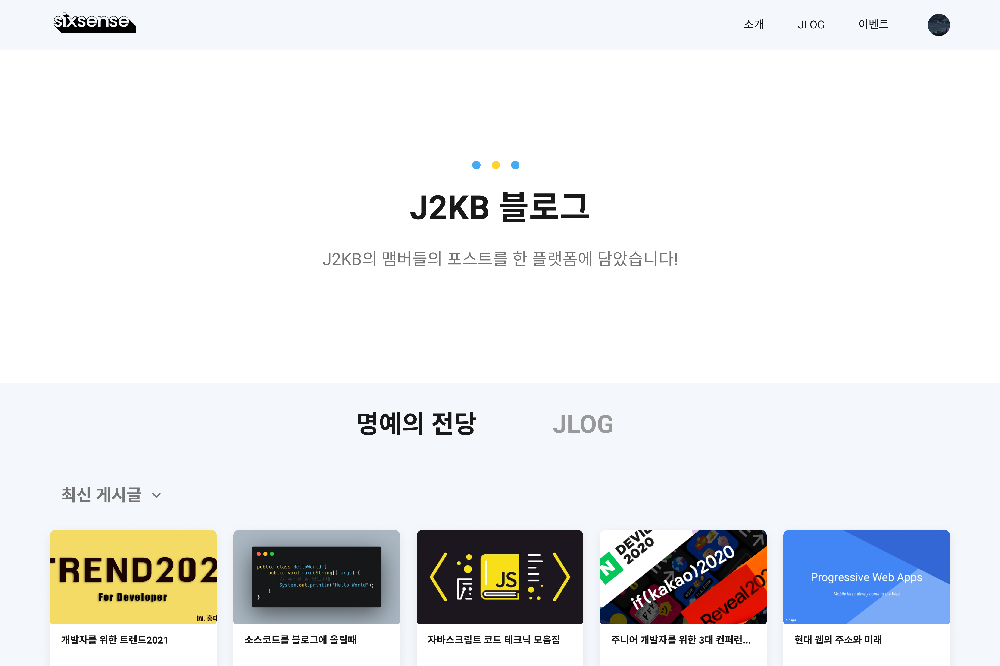

<h3 style="color:#e74c3c; font-weight:bold; text-align:center; margin-bottom:120px;">
본래 리포지토리는 비공개 상태여서 임시로 복사했습니다.
</h3>

  

 

> [프로토타입 보러 가기](https://www.figma.com/file/LrlEAm7GPvM0eq8Uq9j6rB/sixsense?node-id=41%3A3587)

 

- TIL, 블로그, 깃허브에서 새로운 글이나 커밋 등이 발생시 종합하여 알려주는 서비스
- 크롤링을 통해 IT 세미나/컨퍼런스 정보를 수집 및 설치
