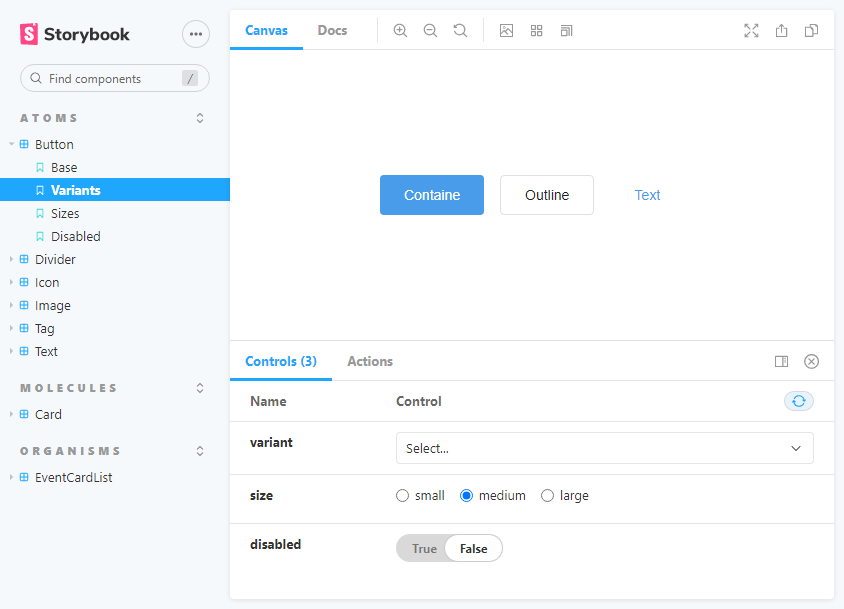

# SSWEB-client



---

## How can I see the work?

### 1. SSWEB Project 복제

```bash
$ git clone https://github.com/J2KB/SixSense-SSWEB.git
```

### 2. Dependency를 설치합니다

```bash
$ cd SixSense-SSWEB/ssweb-client

# or npm install
$ yarn
```

### 3. 이제 로컬에서 확인하실 수 있습니다!

```bash
# or npm run start:storybook
$ yarn start:storybook
```

<br/>

## Folder Structure

```
   .
    ├── src
    │   ├── assets
    │   │   ├── icons
    │   │   └── images
    │   ├── components                # 컴포넌트 정의
    │   │   ├── atoms
    │   │   ├── molecules
    │   │   ├── organisms
    │   │   ├── templates
    │   │   └── views
    │   ├── stories                   # 컴포넌트 문서화
    │   │   ├── atoms
    │   │   ├── molecules
    │   │   └── organisms
    │   └── styles                    # 전역으로 사용할 스타일 정의
    │       ├── global
    │       ├── theme
    │       └── utils
    ├── test                          # Side effect 위주로 테스트
    └── ...
```

### [Atomic design](https://bradfrost.com/blog/post/atomic-web-design/)

- `Atoms`: 이 이상 쪼갤수 없으며, 재사용의 가능성이 많은 컴포넌트를 정의
- `Molecules`: `Atoms` 컴포넌트의 그룹, 이것만으로도 유용하지만 한 가지 기능만 출중
- `Organisms`: `Atoms`/`Molecules` 컴포넌트의 그룹, 서비스에 특화 하도록 구체화
- `Templates`: 페이지의 레이아웃을 정의
- `Views`: `Templates`의 인스턴스, 지금까지 만든 컴포넌트들을 조립
